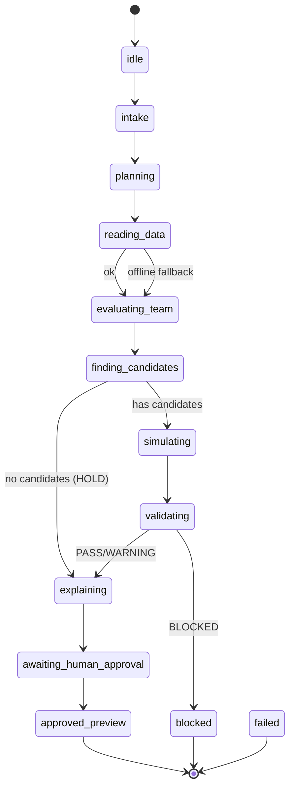

# Agent Decision Flow

> Milestone: M8-E1 (docs-only)
>
> Status: Decision chain / state machine / trace schema contract.
> No runtime code in this milestone.
>
> Scope: This document defines how the Agent moves from user intent to
> a human-approval gate, the decision state machine, the trace schema
> the frontend can render, and the failure/fallback rules for 10
> known scenarios.

---

## 0. 项目重心

FrontOffice-Offseason-Agent 的重心是 **Agent**，不是 NBA 数据库。
真实 snapshot 只是 Agent 的**数据燃料**。Agent 的职责是：

1. 理解用户目标
2. 拆解任务
3. 调用只读/模拟工具
4. 让确定性服务做裁决
5. 把结果整理成人话建议
6. 停在人工确认 gate 前

Agent **不是** autonomous trade executor。所有执行都在本系统之外，
且必须有人工确认。

---

## 1. 七大步总览

| 步 | 名称 | 说明 | 是否自动 | 是否需确认 |
|----|------|------|----------|------------|
| 1 | 用户输入目标 | 用户给出 team_id + objective | — | — |
| 2 | Agent 拆解任务 | 规划工具调用顺序 | 自动 | 否 |
| 3 | 检索/读取球队数据 | 读 cap / roster / 位置缺口 | 自动 | 否 |
| 4 | 调用工具模拟签约或交易 | 生成只读 preview | 自动 | preview 需确认 |
| 5 | 薪资规则和阵容风险校验 | 确定性裁决 PASS/WARNING/BLOCKED | 自动 | 否（裁决本身） |
| 6 | 给出带证据的建议 | 整理 evidence + 人话建议 | 自动 | 建议需确认 |
| 7 | 人工确认后才允许进入下一步 | 不可跳过的 gate | **停下** | **是** |

统一文案：

> 这是只读预览，不会自动执行。

---

## 2. Agent Overall Flow（10 步展开）

把七大步展开成 10 个可观测步骤。每一步对应一个 trace step。

### Step 1: User Intent Intake

| 字段 | 值 |
|------|-----|
| `purpose` | 接收用户目标（team_id、objective、target_positions、max_salary）。 |
| `input` | OffseasonGoal |
| `tool used` | 无（直接消费用户输入） |
| `output` | normalized goal |
| `user-visible trace text` | 「理解目标：为 GSW 寻找前场帮助」 |
| `failure behavior` | goal 非法 → blocked，返回「目标不明确」。 |

### Step 2: Plan Generation

| 字段 | 值 |
|------|-----|
| `purpose` | 根据目标规划工具调用顺序。 |
| `input` | normalized goal |
| `tool used` | 无（Agent 内部规划，M8-E5 之前为 stub） |
| `output` | plan（工具序列） |
| `user-visible trace text` | 「规划分析步骤」 |
| `failure behavior` | 无法规划 → blocked。 |

### Step 3: Data Source Check

| 字段 | 值 |
|------|-----|
| `purpose` | 读取当前数据源状态。 |
| `input` | 无 |
| `tool used` | `load_active_data_source` |
| `output` | source_context（demo / snapshot / offline） |
| `user-visible trace text` | 「读取当前数据」 |
| `failure behavior` | offline → fallback demo + warning；historical snapshot 不得说成 live。 |

### Step 4: Team Context Inspection

| 字段 | 值 |
|------|-----|
| `purpose` | 读取球队薪资、阵容、位置缺口。 |
| `input` | team_id |
| `tool used` | `inspect_team_context` |
| `output` | cap summary、roster、position gaps |
| `user-visible trace text` | 「分析球队现状」 |
| `failure behavior` | team 不在当前数据源 → blocked，不跨源拼接。 |

### Step 5: Candidate Retrieval

| 字段 | 值 |
|------|-----|
| `purpose` | 按位置/预算/角色筛候选。 |
| `input` | position、max_salary、role |
| `tool used` | `find_candidate_players` |
| `output` | candidate list |
| `user-visible trace text` | 「查找候选球员」 |
| `failure behavior` | 无候选 → HOLD 建议；薪资缺失 → 移出候选集。 |

### Step 6: Simulation

| 字段 | 值 |
|------|-----|
| `purpose` | 生成签约或交易的只读 preview。 |
| `input` | team_id、player_id / trade pairs |
| `tool used` | `simulate_signing` / `simulate_trade` |
| `output` | preview 对象（projected cap、depth chart） |
| `user-visible trace text` | 「模拟方案」 |
| `failure behavior` | salary 不一致 → blocked。 |

### Step 7: Validation

| 字段 | 值 |
|------|-----|
| `purpose` | 薪资规则 + 阵容风险裁决。 |
| `input` | preview |
| `tool used` | `validate_salary_rules` + `validate_roster_balance` + `validate_data_quality` |
| `output` | verdict (PASS/WARNING/BLOCKED) + roster risk + data quality flags |
| `user-visible trace text` | 「检查薪资规则」「检查阵容影响」「核对数据质量」 |
| `failure behavior` | BLOCKED → 停止，不进入建议；warning → 继续但标注。 |

### Step 8: Evidence Assembly

| 字段 | 值 |
|------|-----|
| `purpose` | 收集 evidence notes、source URLs、confidence。 |
| `input` | team_id、player_ids、topics |
| `tool used` | `collect_evidence` |
| `output` | evidence list |
| `user-visible trace text` | 「整理支持证据」 |
| `failure behavior` | 无 evidence → warning，不编造。 |

### Step 9: Recommendation Generation

| 字段 | 值 |
|------|-----|
| `purpose` | 把工具结果整理成人话建议。 |
| `input` | 全部上游 envelope |
| `tool used` | `generate_recommendation_explanation` |
| `output` | recommendation text + risk summary |
| `user-visible trace text` | 「生成建议」 |
| `failure behavior` | 上游缺失 → 保守模板「数据不足，建议人工复核」。 |

### Step 10: Human Approval Gate

| 字段 | 值 |
|------|-----|
| `purpose` | 不可跳过的人工确认 gate。 |
| `input` | recommendation |
| `tool used` | `request_human_approval` |
| `output` | approval_state=pending → approved_preview（确认后） |
| `user-visible trace text` | 「等待人工确认」 |
| `failure behavior` | 上游缺失 → blocked。确认后**最多**进入 approved_preview，不执行。 |

---

## 3. Decision State Machine

### 3.1 状态列表

| 状态 | 说明 |
|------|------|
| `idle` | 初始态，未接收目标。 |
| `intake` | 接收用户目标。 |
| `planning` | 规划工具序列。 |
| `reading_data` | 读数据源状态。 |
| `evaluating_team` | 读球队上下文。 |
| `finding_candidates` | 筛候选。 |
| `simulating` | 生成 preview。 |
| `validating` | 规则 + 阵容 + 数据质量校验。 |
| `explaining` | 生成建议。 |
| `awaiting_human_approval` | **停下**，等人工确认。 |
| `approved_preview` | 确认后状态，**不等于**真实交易获批。 |
| `blocked` | 不可继续（BLOCKED 或非法输入）。 |
| `failed` | 系统错误。 |

### 3.2 状态转移规则

- **可自动前进**：`idle → intake → planning → reading_data → evaluating_team → finding_candidates → simulating → validating → explaining`
- **必须停下**：`explaining → awaiting_human_approval`（不可跳过）
- **确认后**：`awaiting_human_approval → approved_preview`（仅此一个去向）
- **不可跳过**：`reading_data`（任何读取前必须先 load 数据源）、`validating`（任何建议前必须 validate）、`awaiting_human_approval`
- **失败 fallback**：
  - `reading_data` 失败 → fallback demo + warning，继续
  - `finding_candidates` 无候选 → HOLD，继续到 explaining
  - `validating` BLOCKED → `blocked`，停止
  - 任何系统错误 → `failed`
- **approved_preview 不等于真实交易或签约获批**。真实执行不在本系统范围。

### 3.3 状态图（mermaid，无需额外工具渲染即可阅读）

> 说明：mermaid 仅作可读示意，不依赖额外渲染工具。状态转移的
> 真相以本文档表格为准。

---

## 4. Agent Trace Schema

前端可展示的 trace schema。主层只显示人话，技术详情默认折叠。

### 4.1 Run-level fields

| 字段 | 类型 | 说明 |
|------|------|------|
| `run_id` | string | 本次 run 唯一 id。 |
| `intent_type` | string | signing / trade / hold / explore。 |
| `overall_status` | string | running / completed / blocked / failed / awaiting_approval。 |
| `current_state` | string | 决策状态机当前状态。 |
| `data_source_label` | string | 人话数据源标签（「演示数据」/「2025-26 赛季历史数据」/「本地备用演示数据」）。 |
| `steps` | Step[] | 步骤数组。 |
| `requires_human_approval` | boolean | 是否需要人工确认。 |
| `approval_state` | string | pending / approved / rejected。 |
| `final_message` | string | 人话最终消息。 |

### 4.2 Step-level fields

| 字段 | 类型 | 说明 |
|------|------|------|
| `step_id` | string | 步骤唯一 id。 |
| `sequence` | int | 序号。 |
| `status` | string | pending / running / completed / warning / blocked。 |
| `title` | string | 人话标题（见 4.3）。 |
| `plain_language_summary` | string | 人话摘要。 |
| `tool_name` | string | 工具名（技术详情，折叠）。 |
| `inputs_summary` | object | 输入摘要（不含原始大对象）。 |
| `outputs_summary` | object | 输出摘要（不含原始大对象）。 |
| `warnings` | string[] | 警告列表。 |
| `evidence_ids` | string[] | 相关 evidence id。 |
| `requires_human_review` | boolean | 是否需人工复核。 |
| `technical_details` | object | 调试详情（折叠）。 |
| `started_at` | string | 开始时间。 |
| `finished_at` | string | 结束时间。 |

### 4.3 前端主层人话标题

主层只显示以下人话标题，不显示 raw JSON、长 snapshot_id、resolver
类名、validator warning 数量作为主文案：

| step | 人话标题 |
|------|---------|
| Data Source Check | 「读取当前数据」 |
| Team Context Inspection | 「分析球队现状」 |
| Candidate Retrieval | 「查找候选球员」 |
| Simulation | 「模拟方案」 |
| Salary Validation | 「检查薪资规则」 |
| Roster Balance | 「检查阵容影响」 |
| Evidence Assembly | 「整理支持证据」 |
| Human Approval Gate | 「等待人工确认」 |

技术详情（tool_name、snapshot_id、warning count、resolver kind）
全部放进 `technical_details`，前端默认折叠。

---

## 5. Failure and Fallback Rules

10 个已知场景。每个场景写：user-facing message、internal status、
whether recommendation is allowed、whether human approval is required、
whether to block。

### 5.1 backend offline

| 字段 | 值 |
|------|-----|
| user-facing message | 「后端暂时不可用，正在使用本地备用演示数据。」 |
| internal status | `offline_fallback` |
| recommendation allowed | 是（但必须标注 offline fallback） |
| human approval required | 是 |
| block | 否（fallback 继续，但所有结果标 offline） |

### 5.2 data source is demo

| 字段 | 值 |
|------|-----|
| user-facing message | 「当前为演示数据，不代表真实 NBA 阵容或薪资。」 |
| internal status | `demo_mode` |
| recommendation allowed | 是 |
| human approval required | 是 |
| block | 否 |

### 5.3 snapshot valid but has manual_review warnings

| 字段 | 值 |
|------|-----|
| user-facing message | 「数据为 2025-26 历史样本，部分薪资和合同细节仍需人工复核。」 |
| internal status | `snapshot_with_manual_review` |
| recommendation allowed | 是 |
| human approval required | **是**（manual review 数据必须确认） |
| block | 否 |

### 5.4 candidate has missing salary

| 字段 | 值 |
|------|-----|
| user-facing message | 「候选球员 X 缺少薪资数据，已从候选列表移除。」 |
| internal status | `candidate_salary_missing` |
| recommendation allowed | 是（用剩余候选） |
| human approval required | 是 |
| block | 否 |

### 5.5 salary validation fails

| 字段 | 值 |
|------|-----|
| user-facing message | 「薪资规则校验未通过：超出第二 apron。」 |
| internal status | `salary_validation_blocked` |
| recommendation allowed | 否 |
| human approval required | — |
| block | **是**（BLOCKED，停止） |

### 5.6 trade salary matching fails

| 字段 | 值 |
|------|-----|
| user-facing message | 「交易薪资配平失败，两队薪资差额超出容差。」 |
| internal status | `trade_salary_mismatch` |
| recommendation allowed | 否 |
| human approval required | — |
| block | **是** |

### 5.7 evidence missing

| 字段 | 值 |
|------|-----|
| user-facing message | 「未找到支持该建议的证据，建议人工复核。」 |
| internal status | `evidence_missing` |
| recommendation allowed | 是（但标注无证据） |
| human approval required | 是 |
| block | 否 |

### 5.8 user asks for unsupported team

| 字段 | 值 |
|------|-----|
| user-facing message | 「球队 X 不在当前数据源覆盖范围内（当前覆盖：勇士、太阳）。」 |
| internal status | `team_not_found` |
| recommendation allowed | 否 |
| human approval required | — |
| block | **是** |

### 5.9 user asks for current real-time NBA data but current data is historical snapshot

| 字段 | 值 |
|------|-----|
| user-facing message | 「当前数据为 2025-26 历史样本，不是实时数据。如需最新阵容请等待后续数据更新。」 |
| internal status | `historical_not_live` |
| recommendation allowed | 是（基于历史样本） |
| human approval required | 是 |
| block | 否 |

### 5.10 LLM tries to suggest something not supported by tool output

| 字段 | 值 |
|------|-----|
| user-facing message | 「该建议缺少工具支持，已忽略。仅展示经确定性工具验证的结果。」 |
| internal status | `llm_suggestion_rejected` |
| recommendation allowed | 是（仅用工具结果） |
| human approval required | 是 |
| block | 否（LLM 建议被丢弃，不 block 整个 run） |

---

## 6. Implementation Roadmap

| 里程碑 | 内容 | 是否接 OpenAI |
|--------|------|---------------|
| **M8-E1**（本文档） | docs-only Agent tool contract + decision flow | 否 |
| M8-E2 | backend trace schema 扩展 | 否 |
| M8-E3 | frontend trace display | 否 |
| M8-E4 | guardrail tests | 否 |
| M8-E5 | optional orchestrator stub（只读 stub） | **否（不接 OpenAI API）** |

强调：
- M8-E1 只写文档，不改代码。
- M8-E2 才开始扩展 trace schema。
- M8-E5 也不接 OpenAI API，只做只读 orchestrator stub。

---

## 7. Acceptance Criteria

- ✅ 11 个工具都有明确输入输出（见 agent-tool-contract.md 第 4 节）。
- ✅ 工具与 LLM 权限边界清楚（见 agent-tool-contract.md 第 1、6 节）。
- ✅ trace schema 支持前端展示（本文档第 4 节）。
- ✅ failure fallback 全覆盖（本文档第 5 节，10 个场景）。
- ✅ human approval gate 明确（见 agent-tool-contract.md 第 3 节）。
- ✅ 不涉及真实执行。
- ✅ 不涉及 30 队数据扩展。
- ✅ 不涉及 runtime API scraping。
- ✅ 后续实现可以拆成小任务封口（M8-E2 ~ M8-E5）。

---

## 8. 本文档不涉及

- 真实 NBA API 接入
- 30 队数据扩展
- runtime API scraping
- 自动落库 / 自动执行 / 真实交易执行
- LLM 直接调用 OpenAI API（M8-E 不接 OpenAI）
- 把 Agent 写成可以自由执行交易的 autonomous agent
- 引入「自动落库/自动执行/真实交易执行」能力
